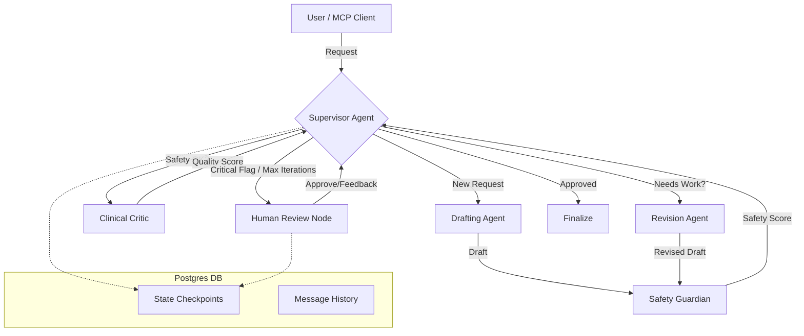

```mermaid
graph TD
    User[User / MCP Client] -->|Request| Supervisor
    Supervisor{Supervisor Agent}
    
    Supervisor -->|New Request| Drafter[Drafting Agent]
    Drafter -->|Draft| Safety[Safety Guardian]
    Safety -->|Safety Score| Supervisor
    
    Supervisor -->|Safety OK?| Critic[Clinical Critic]
    Critic -->|Quality Score| Supervisor
    
    Supervisor -->|Needs Work?| Reviser[Revision Agent]
    Reviser -->|Revised Draft| Safety
    
    Supervisor -->|Critical Flag / Max Iterations| Human[Human Review Node]
    Human -->|Approve/Feedback| Supervisor
    
    Supervisor -->|Approved| Final[Finalize]
    
    subgraph "Postgres DB"
        Checkpoint[State Checkpoints]
        History[Message History]
    end
    
    Supervisor -.-> Checkpoint
    Human -.-> Checkpoint
```
