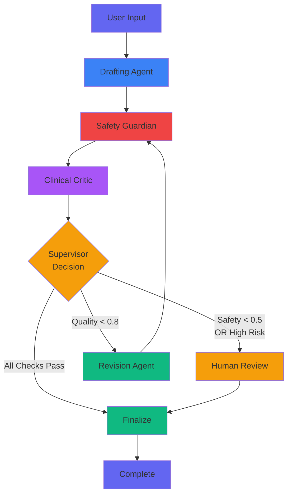

# Cerina Protocol Foundry - System Architecture

## High-Level Overview

```
┌──────────────────────────────────────────────────────────────┐
│                        USER INTERFACES                        │
├────────────────────┬─────────────────────┬──────────────────┤
│   Web UI (React)   │   REST API          │  Claude (MCP)    │
│   :5173            │   :8000             │  Desktop         │
└─────────┬──────────┴──────────┬──────────┴──────────┬───────┘
          │                     │                       │
          └─────────────────────┼───────────────────────┘
                                │
                    ┌───────────▼────────────┐
                    │   FastAPI Backend      │
                    │   - REST Endpoints     │
                    │   - SSE Streaming      │
                    │   - State Management   │
                    └───────────┬────────────┘
                                │
                    ┌───────────▼────────────┐
                    │   LangGraph Workflow   │
                    │   - 5 Agent System     │
                    │   - Conditional Routing│
                    │   - Checkpointing      │
                    └───────────┬────────────┘
                                │
          ┌─────────────────────┼─────────────────────┐
          │                     │                     │
┌─────────▼──────────┐ ┌───────▼────────┐  ┌────────▼─────────┐
│   PostgreSQL       │ │  OpenRouter    │  │  Agent State     │
│   - Checkpoints    │ │  LLM API       │  │  (In-Memory)     │
│   - Workflow Logs  │ │  (Gemini)      │  │                  │
│   - Drafts         │ └────────────────┘  └──────────────────┘
└────────────────────┘
```

---

## Multi-Agent Workflow



---

## Agent Responsibilities

### 🎨 **Drafting Agent**
- **Input**: User intent
- **LLM Prompt**: Clinical CBT protocol design template
- **Output**: Structured JSON protocol with steps, exposure levels
- **Temperature**: 0.7 (creative but structured)

### 🛡️ **Safety Guardian Agent**
- **Input**: Draft protocol
- **Checks**: Self-harm risk, extreme exposure, harmful language
- **Output**: Safety score (0-1) + list of SafetyFlags
- **Temperature**: 0.3 (consistent, analytical)
- **Threshold**: < 0.5 triggers halt

### 💙 **Clinical Critic Agent**
- **Input**: Draft protocol
- **Evaluates**: Empathy, tone, clarity, patient-centeredness
- **Output**: Empathy score (0-1) + improvement suggestions
- **Temperature**: 0.4 (balanced)
- **Threshold**: < 0.8 suggests revision

### ✏️ **Revision Agent**
- **Input**: Draft + Safety feedback + Quality feedback
- **Task**: Rewrite problematic sections, enhance empathy
- **Output**: Improved protocol draft
- **Temperature**: 0.6 (creative improvements)

### 🎯 **Supervisor Agent**
- **Input**: Current state (safety_score, empathy_score, iterations)
- **Logic**:
  ```python
  if safety_score < 0.5 or high_risk_flags > 0:
      return "human_review"
  elif iterations >= 3:
      return "human_review"
  elif empathy_score < 0.8:
      return "revision"
  else:
      return "finalize"
  ```
- **Output**: Next node routing decision

---

## State Management

### BlackboardState Schema
```json
{
  "schema_version": 1,
  "thread_id": "string",
  "user_intent": "string",
  "draft_versions": ["json_string", ...],
  "active_draft": "json_string",
  "safety_flags": [
    {
      "segment": "problematic text",
      "risk_level": "low|medium|high",
      "suggestion": "fix recommendation"
    }
  ],
  "safety_score": 0.0-1.0,
  "empathy_score": 0.0-1.0,
  "iterations": 0,
  "status": "running|halted|final",
  "metadata": {},
  "agent_messages": []
}
```

### Checkpointing
- **Technology**: LangGraph PostgresSaver
- **Storage**: Serialized state after each node
- **Recovery**: Resume from last checkpoint on crash
- **Table**: `checkpoints` with thread_id + checkpoint_id

---

## API Endpoints

| Endpoint | Method | Purpose |
|----------|--------|---------|
| `/run` | POST | Start new workflow |
| `/state/{thread_id}` | GET | Fetch current state |
| `/edit/{thread_id}` | POST | Update active draft |
| `/approve/{thread_id}` | POST | Resume after review |
| `/events/{thread_id}` | GET | SSE event stream |

---

## Database Schema

### Core Tables

**checkpoints** (LangGraph)
- thread_id (PK)
- checkpoint_id (PK)
- checkpoint (JSONB)
- created_at

**workflow_logs**
- thread_id
- agent_name
- event_type
- message
- created_at

**protocol_drafts**
- thread_id
- version
- content
- safety_score
- empathy_score

**safety_flags**
- thread_id
- draft_version
- segment
- risk_level
- suggestion

---

## Technology Stack

### Backend
- **Python 3.12**
- **FastAPI** - REST API + SSE
- **LangGraph** - Agent orchestration
- **LangChain** - LLM abstractions
- **Pydantic v2** - Data validation
- **PostgreSQL** - State persistence
- **asyncpg** - Async DB driver

### Frontend
- **React 18**
- **TypeScript**
- **Vite** - Build tool
- **Native Fetch** - HTTP client
- **EventSource** - SSE

### LLM
- **OpenRouter API**
- **Model**: google/gemini-2.0-flash-exp:free
- **Features**: JSON mode, streaming

### MCP
- **MCP SDK 1.1.2**
- **Protocol**: JSON-RPC over stdio
- **Integration**: Claude Desktop

---

## Security Considerations

1. **API Key Protection**: Environment variables, never committed
2. **Input Validation**: Pydantic models validate all inputs
3. **Safety Checks**: Multi-layer risk detection
4. **Human Review**: Mandatory for high-risk content
5. **CORS**: Restricted to localhost origins
6. **SQL Injection**: SQLAlchemy ORM prevents raw queries

---

## Scalability

### Current Design
- Single-threaded workflow execution
- In-memory state during execution
- PostgreSQL for persistence

### Production Enhancements
- Add Redis for distributed state
- Queue system (Celery/RQ) for async workflows
- Load balancing for API servers
- Read replicas for database
- Caching layer for repeated queries

---

## Monitoring & Observability

### Implemented
- Structured logging (agent messages)
- Event streaming via SSE
- State snapshots in database

### Recommended Additions
- OpenTelemetry tracing
- Prometheus metrics
- Grafana dashboards
- Error tracking (Sentry)
- Audit logs for human reviews

---

## Error Handling

### Workflow Level
- Try/catch in each agent
- Automatic state updates on errors
- Graceful degradation (halt vs crash)

### API Level
- HTTP exception handlers
- Validation error responses
- Timeout handling

### Recovery
- Checkpoint-based resumption
- Idempotent operations
- Transaction rollbacks

---

**Last Updated**: Phase 5 & 6 Complete - 2025-12-10
